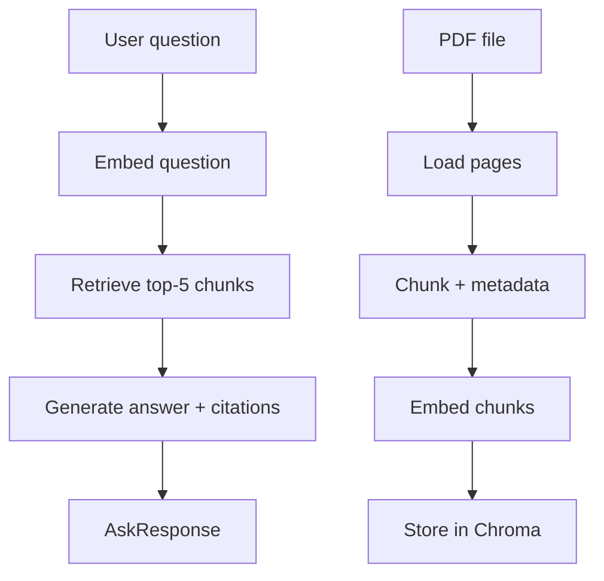

# Design Doc: RAG Engine v1

> **Status:** Shipped P1–P2 (2026-08). Superseded by [rag_v2.md](rag_v2.md) (2026-09). Code trên `main` hiện chạy v2; doc này giữ nguyên thiết kế v1 để tham chiếu và phỏng vấn.

## Requirements

User story: *"I want to ask a question about internal documents (SOPs, workflows, Odoo guides) and receive an answer with citations that point to the exact source passages."*

Constraints:
- Answers must use **only information from the indexed documents** — no hallucination.
- Every answer must include at least one citation (filename + page number).
- PDF ingestion uses `pypdf`; `marker-pdf` is out of scope (heavy model, slow on Windows).
- Vector store: Chroma local (no separate server needed in P1).
- Embeddings: `sentence-transformers/all-MiniLM-L6-v2` (runs locally, no API key).
- LLM: `LLM_MODE=mock` for tests; `real` uses an OpenAI-compatible endpoint.

## Flow Design

### Pattern: RAG (Retrieval-Augmented Generation)

```
ingest → chunk → embed → store        (offline, once per document)
                   ↓
         retrieve → generate + cite   (online, once per question)
```

### Ingest flow (via POST /ingest or a script)

1. **Load** — read PDF with `pypdf`, return `list[str]` per page
2. **Chunk** — `RecursiveCharacterTextSplitter` (chunk_size=800, overlap=150), attach `{source, page}` metadata
3. **Embed** — encode with `SentenceTransformer`, return `list[float]`
4. **Store** — upsert into Chroma collection `rag_docs`, persist to `data/processed/chroma/`

### Ask flow (once per question)

1. **Retrieve** — embed question → similarity search top-5 in Chroma
2. **Generate** — build context + citation hints → call LLM → parse answer + sources



## Utility Functions

1. **load_pdf** (`modules/rag/ingest.py`)
   - Input: `Path`
   - Output: `list[tuple[str, dict]]` — (text, metadata)

2. **chunk_texts** (`modules/rag/chunk.py`)
   - Input: `list[tuple[str, dict]]`
   - Output: `list[Document]`

3. **get_vector_store** (`integrations/vector_store.py`)
   - Returns the Chroma collection; singleton — repeated calls reuse the same client.

4. **embed_and_store** (`modules/rag/index.py`)
   - Input: `list[Document]`
   - Side effect: upsert into Chroma

5. **retrieve_top_k** (`modules/rag/retrieve.py`)
   - Input: `question: str, k: int = 5`
   - Output: `list[Document]`

6. **generate_answer** (`modules/rag/generate.py`)
   - Input: `question: str, context: list[Document]`
   - Output: `RagAnswer(answer: str, sources: list[str])`

## Module Interface

The only public gate is `service.py`:

```python
# modules/rag/service.py
async def ingest_file(path: Path) -> IngestResult: ...
async def ask(question: str) -> RagAnswer: ...
```

`api/` may only import `modules.rag.service` — never internal submodules.

## Data Structures

```python
@dataclass
class Document:
    text: str
    source: str    # filename
    page: int      # 0-indexed page number
    chunk_id: str  # MD5 hash for deduplication

@dataclass
class RagAnswer:
    answer: str
    sources: list[str]  # e.g. ["odoo_guide.pdf p.3", "sop_warehouse.pdf p.7"]

@dataclass
class IngestResult:
    file: str
    num_chunks: int
```

## Decisions and Rejected Alternatives

| Decision | Reason |
|---|---|
| `sentence-transformers` local embeddings | No API key needed; works offline; free |
| Chroma local persist | Sufficient for P1; pgvector considered for later phases |
| chunk_size=800, overlap=150 | Reasonable default; P2 eval harness will show if tuning is needed |
| Hand-rolled retrieval (no LangChain retriever chain) | Keeps each step explicit and testable |

Rejected:
- `marker-pdf` — heavy model download, outside sprint scope
- OpenAI embeddings — costs money; unnecessary for demo and eval
- Chroma server mode — added complexity; deferred to P5

## Definition of Done

- [x] `POST /ingest` accepts a PDF and returns the number of chunks indexed
- [x] `POST /ask` returns a non-empty `answer` and `sources`
- [x] 28 golden questions — recall@5 28/28 (MiniLM, P2 eval)
- [x] `uv run pytest` is green
- [x] `import-linter` reports no layer violations

## Metrics (v1 baseline, frozen)

| Metric | Value | Notes |
|---|---|---|
| Recall@5 | 28/28 (100%) | `evals/datasets/rag_golden.yaml`, 6 sample PDFs |
| Recall@3 | 28/28 (100%) | measured 2026-08-24 |
| Embed model | `all-MiniLM-L6-v2` | local, sentence-transformers |
| Ask path | linear | no agent loop |
