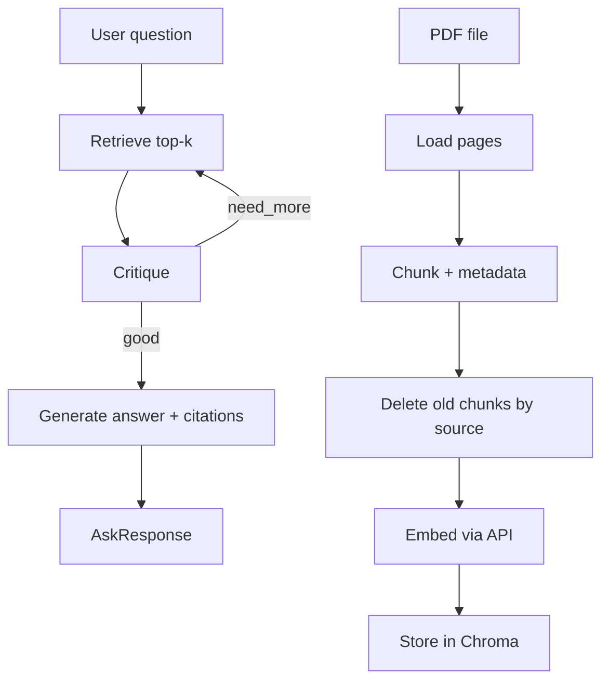

# Design Doc: RAG Engine v2

> **Status:** Current (2026-09). Replaces [rag_v1.md](rag_v1.md) in code; v1 doc kept for history and interview narrative.

## Why v2

| Pain in v1 | v2 change |
|---|---|
| MiniLM + torch heavy; weak Vietnamese without `rag_expand.yaml` hacks | API embeddings (`EMBED_MODE=api`, Gemini/OpenAI-compatible) |
| Linear retrieve once → miss if first pass empty | LangGraph loop: retrieve → critique → retry (up to `max_retrieve_steps`) |
| Re-ingest same filename duplicates chunks in Chroma | `delete_chunks_by_source` before upsert |
| Chunk/prompt hardcoded in Python | `configs/rag.yaml`, `configs/prompts/rag_generate.yaml` |
| No CLI outside HTTP | `rag-cli ingest \| ask` |

**Not in v2 (deferred):** LangChain ReAct agent (LLM chooses tools) like mentor `agentic-chatbot`; cross-encoder rerank; harder eval corpus.

## Requirements

Same user story as v1. Additional constraints:

- Embeddings: `EMBED_MODE=mock|api` via `integrations/embedding_client.py`
- Mock embed: deterministic hash vectors — **CI only**, not for recall metrics
- Changing embed model requires **wipe + re-bootstrap** Chroma (vector space changes)
- Public API unchanged: `service.ingest_file()`, `service.ask()` — HTTP routes unchanged

## Flow Design

### Ingest (offline)

```
PDF → load_pdf → chunk (config from rag.yaml)
    → delete_chunks_by_source(filename)
    → embed_documents (API or mock)
    → upsert Chroma (metadata: source, page, doc_id, ingested_at)
```

### Ask (online — LangGraph)

```
question → retrieve (embed query + Chroma top-k)
         → critique (enough docs? steps < max?)
         → [need_more → retrieve again with alternate query]
         → generate (LLM + citations)
```



### Critique (v2.0 — rule-based)

- If `docs` non-empty → proceed to generate
- If empty and `retrieve_steps < max_retrieve_steps` → retrieve again
- Alternate query: step 0 = `expand_query(question)`; step 1 = raw question

Future (v2.1+): LLM critique or LangChain agent node like mentor orchestrator.

## Module map

```
modules/rag/
├── service.py              # Public gate — api/ imports only here
├── config.py               # configs/rag.yaml, prompts
├── ingestion/
│   ├── load.py             # pypdf → page texts
│   └── chunk.py            # Document, chunk_texts
├── indexing/
│   └── store.py            # embed_and_store → Chroma
├── retrieval/
│   └── search.py           # expand_query, retrieve_with_query, top-k
├── generation/
│   └── answer.py           # RagAnswer, generate_answer
└── orchestration/
    ├── graph.py            # LangGraph compile
    ├── state.py            # RagState
    └── nodes/              # retrieve, critique, generate
```

Shared infra (outside `rag/`): `integrations/embedding_client.py`, `integrations/vector_store.py`.

## Config

`configs/rag.yaml`:

```yaml
chunk_size: 800
chunk_overlap: 150
top_k: 5
max_retrieve_steps: 3
embed_batch_size: 32
```

Environment (`.env`):

| Variable | Values | Purpose |
|---|---|---|
| `EMBED_MODE` | `mock` \| `api` | Embed path |
| `EMBED_MODEL` | e.g. `text-embedding-004` | API model name |
| `OPENAI_BASE_URL` | Gemini OpenAI-compatible URL | Same key as LLM |
| `LLM_MODE` | `mock` \| `real` | Generate only; independent of embed |

## Data Structures (changes from v1)

```python
@dataclass
class Document:
    text: str
    source: str
    page: int
    chunk_id: str
    doc_id: str = ""       # UUID per ingest batch
    ingested_at: str = ""  # ISO timestamp
```

`RagState` (graph internal):

```python
class RagState(TypedDict, total=False):
    question: str
    query: str
    top_k: int
    docs: list[Document]
    retrieve_steps: int
    need_more: bool
    answer: str
    sources: list[str]
```

## Entry points

| Entry | Command / route |
|---|---|
| HTTP ingest | `POST /ingest` |
| HTTP ask | `POST /ask` |
| HTTP chat | `POST /chat` (dispatcher) |
| CLI | `uv run rag-cli ingest --file X [--reset]` |
| CLI | `uv run rag-cli ask "question" [--top-k 5]` |
| Bootstrap | `uv run python scripts/bootstrap_local.py --reset-chroma` |
| Eval | `uv run python -m evals.run` |

## Eval notes

- **Recall@k meaningful only with `EMBED_MODE=api`** after re-bootstrap
- `EMBED_MODE=mock` uses hash vectors — recall is random-ish; use for pipeline smoke only
- v1 baseline: 28/28 recall@5 (MiniLM) — see [rag_v1.md](rag_v1.md)
- v2 mock baseline (2026-09-04): 18/28 — not comparable to v1

## Decisions and Rejected Alternatives

| Decision | Reason |
|---|---|
| API embeddings | No torch on retrieve path; better multilingual; parity mentor |
| LangGraph StateGraph (hand-rolled nodes) | Same pattern as `text2sql/graph.py`; explicit steps |
| Rule-based critique first | Testable without LLM quota; multi-step loop proven in unit tests |
| `delete_chunks_by_source` | Clean re-ingest; fixes Chroma "messy corpus" |
| OpenAI client for embed | Reuse dependency; Gemini OpenAI-compatible endpoint |
| Keep `langchain-text-splitters` only | LangChain Agent not required for v2.0 |

Rejected:
- Run v1 and v2 code paths in parallel — double maintenance
- Keep MiniLM alongside API vectors — incompatible vector spaces in one collection
- `google-genai` SDK (mentor) — deferred; OpenAI-compatible embed sufficient for text-only RAG

## Definition of Done (v2.0)

- [x] No `sentence-transformers` on ingest/retrieve path
- [x] `EMBED_MODE=api` supported; mock for CI
- [x] LangGraph agent loop with unit test multi-step retrieve
- [x] Re-ingest does not duplicate chunks
- [x] CLI `ingest` + `ask`
- [x] `evals/run.py` runs; reports `EMBED_MODE`
- [ ] Recall@5 with `EMBED_MODE=api` measured and recorded
- [ ] LLM agent critique (v2.1 stretch)

## Migration from v1

1. Set `EMBED_MODE=api` and embed model in `.env`
2. `uv run python scripts/bootstrap_local.py --reset-chroma`
3. Re-ingest user-uploaded PDFs (vector space changed)
4. Run `uv run python -m evals.run` with `EMBED_MODE=api` for new baseline
