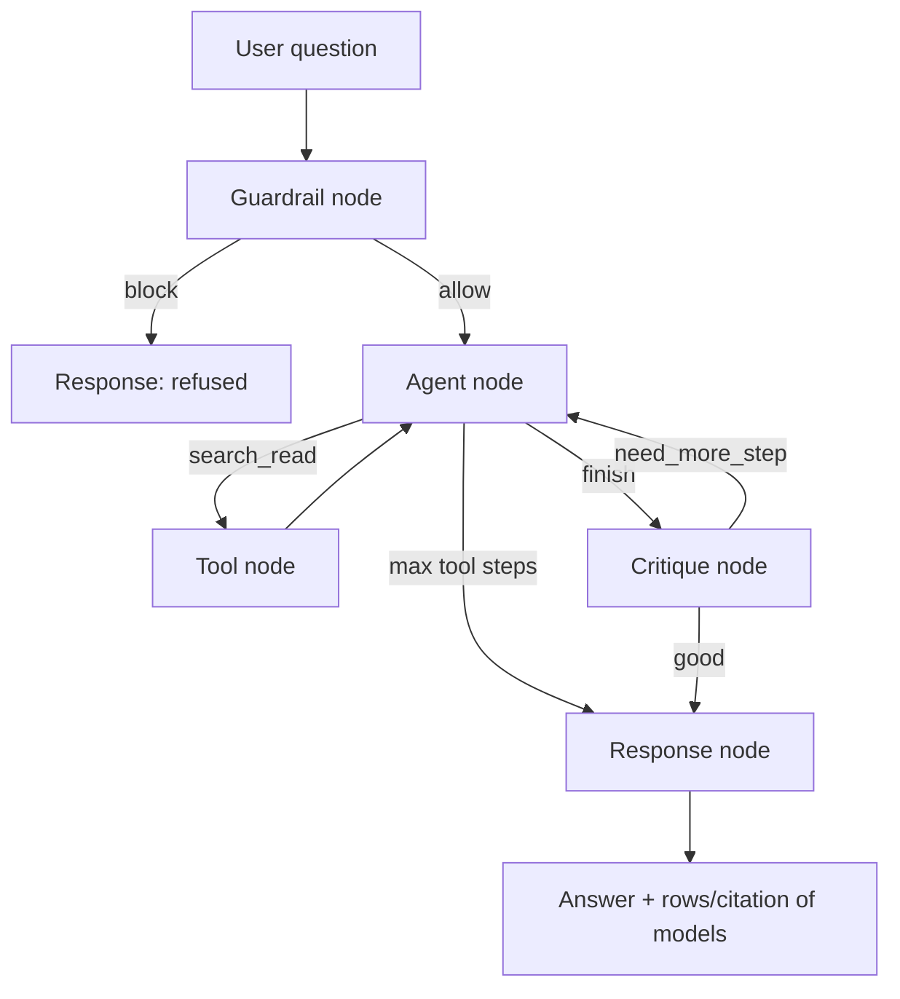

# Design Doc: Structured query engine v1 (text2sql module)

P3. Answers **numeric / record** questions from mock Odoo (SQLite) via `modules/erp`. Not RAG. Not live Odoo JSON-RPC (P6).

Name `text2sql` = **structured path** (question → filter/read → metric). On mock we may look like Text-to-SQL. On live Odoo the same module should call `search_read`, not raw Postgres.

## Requirements

User story: *"I want to ask in Vietnamese or English about orders, customers, products, or stock on the mock ERP and get an answer backed by actual rows, not invented numbers."*

Operator story: *"A question that tries to change data, leave the allowed models, or dump the whole database must be refused."*

Done when (BUILD_PLAN):

- 15 metric/list questions return the right number or rows.
- 3 dangerous questions are blocked: write intent (`UPDATE`/`DELETE`), out of scope, forbidden table/model.
- Record: correct / 15; mean tool steps; true positives vs false blocks on the 3.

## Scope

| In | Out |
|---|---|
| LangGraph: guardrail → agent ⇄ tool → critique → response | Dispatcher / one chat box (P4) |
| Tool talks to `ErpAdapter.search_read` | Raw SQL into SQLite **or** Odoo Postgres |
| Allowed models only: `res.partner`, `product.product`, `sale.order`, `sale.order.line`, `stock.quant` | `account.move`, res.users passwords, arbitrary tables |
| `LLM_MODE=mock` in tests | Live Odoo (`odoo.py` stays stub) |
| `POST /query` or reuse `/ask` later via dispatcher | Hybrid RAG+data in this module |

## Decision: `search_read`, not generated SQL (v1)

| Option | Why rejected / kept |
|---|---|
| **A. Agent writes SQL, execute on SQLite** | Matches mentor `text2sql_agent`. Easy on mock. **Breaks the P6 story**: live Odoo must not get LLM SQL (record rules). Two execution paths forever. |
| **B. Agent writes Odoo domain + model, `search_read`** | Same adapter mock and P6. Guardrail = allowlist models + operators + `limit`. **Keep for v1.** |
| **C. Whitelist metric tools only** (`revenue_mtd`) | Safest, least “agentic”. Stretch after 15 questions if domain generation is too flaky. |

Mock SQLite implements a **subset** of domain: `= != > >= < <= in ilike`, AND only. Agent must stay inside that subset.

SQL-style guardrail still exists at **execution**, not as a SQL parser: unknown model → error; `limit` cap; read-only connection.

## Flow Design

### Patterns

1. **ReAct** — agent chooses `search_read` or `finish`.
2. **Reflection** — critique may send the agent back (`need_more_step`).
3. **Two-layer guardrail** — intent (LLM/rules) then adapter/runtime.



### Nodes

1. **Guardrail** — out of scope (HR, unrelated chat), write intent, “dump all tables”. Output `allow` | `block` + reason. Start with **rules + small LLM**; tests can force mock decisions.
2. **Agent** — schema from `erp.get_schema()`, observations, critique feedback. Action: `search_read` `{model, domain, fields, limit}` or `finish`.
3. **Tool** — `ErpAdapter.search_read(...)`. Observation = rows or error string. Increment `tool_steps`.
4. **Critique** — enough evidence? `good` | `need_more_step`. If `tool_steps >= max_tool_steps`, skip to response.
5. **Response** — natural language from rows; if blocked, return reason only.

### Budget

| Setting | Default |
|---|---|
| `max_tool_steps` | 8 (mock schema is tiny; 10 like mentor is optional) |
| `search_read` `limit` | max 100 (adapter already) |

## Module layout

```
modules/text2sql/
  service.py      # only public gate: ask(question) -> DataAnswer
  graph.py        # compile StateGraph
  state.py
  nodes/          # guardrail, agent, tool, critique, response
```

`api` imports **only** `text2sql.service`. Tool imports `erp` (mock/odoo factory from config `erp_mode`). `rag` is not imported.

## Data structures

```python
@dataclass
class DataAnswer:
    answer: str
    blocked: bool
    block_reason: str | None
    models_used: list[str]
    tool_steps: int
```

## Prompts

Versioned YAML under `configs/prompts/` (e.g. `text2sql.yaml`). Not hard-coded long strings in nodes.

## Tests (P3)

- Adapter already: unknown model raises (`test_erp_mock.py`).
- Guardrail: 3 blocked cases without hitting a real LLM (`LLM_MODE=mock`).
- Happy path: at least one `search_read` for “sale orders in state sale” using fixture DB from `generate_mock_odoo.py`.

Golden 15 questions: add `evals/datasets/data_golden.yaml` when the graph runs (not required on day 1 of the design).

## Definition of Done

- [x] `docs/design/text2sql_v1.md` (this file)
- [x] Graph compiles; `service.ask` is the only API entry
- [x] 3 dangerous questions blocked
- [x] 15 data questions correct on mock SQLite
- [x] `uv run pytest` green; import-linter: `text2sql` does not import `rag`

v1 slice shipped 27/08: guardrail → **one** `search_read` → response (`POST /query`). ReAct + critique still open.
